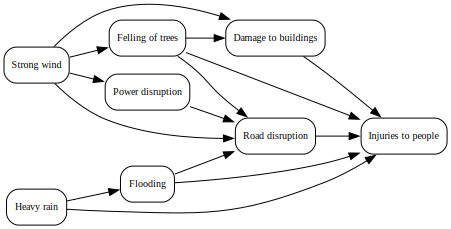
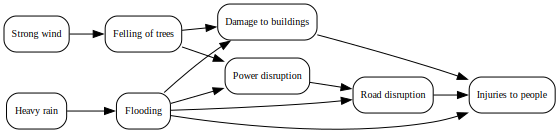

# LLM-SocialMedia-Causality: Ground-Truth Hurricane Causal Graphs

This repository provides ground-truth causal graphs for selected U.S. hurricanes, constructed using the Impact Chain concept, and validated through NOAA expert reports.

---
## Disaster Impact Chain Framework

The **Impact Chain framework** is a standardized approach for analyzing cause–effect relationships in climate-related hazards. Introduced in the *Vulnerability Sourcebook* (Zebisch et al., 2021) and extended by Pittore et al. (2023) for multi-hazard exposure modeling, it describes how environmental drivers lead to hazards, exposure, and impacts.

Here, the framework is applied to two hurricanes, focusing on hazard-to-impact relationships. Note that vulnerability components are excluded due to challenges to obtain expert level knowledges from the impact chain framework.

---

## Causal Graphs for Two Hurricanes 

Starting from a [Impact Chain for storm events](docs/impact_chain_for_storm.svg), we extract only those cause–effect links explicitly supported by NOAA’s Tropical Cyclone Reports. Validation emphasizes relationships such as flooding–injury and wind–damage connections.

| Hurricane | Causal Graph | Graphviz Source | Evidence Summary | NOAA Report |
|------------|---------------|-----------------|------------------|--------------|
| Irma (2017) |  | [DOT](data/hurricane_irma/hurricane_irma_causal_graph.dot) | [Summary](data/hurricane_irma/evidence_summary.md) | [NOAA Report](https://www.nhc.noaa.gov/data/tcr/AL112017_Irma.pdf) |
| Harvey (2017) |  | [DOT](data/hurricane_harvey/hurricane_harvey_causal_graph.dot) | [Summary](data/hurricane_harvey/evidence_summary.md) | [NOAA Report](https://www.nhc.noaa.gov/data/tcr/AL092017_Harvey.pdf) |

---

## References

- Pittore, M., Campalani, P., Renner, K., Tagliavini, F., et al. (2023).  
  *Border-independent multi-functional, multi-hazard exposure modelling in Alpine regions.*  
  *Natural Hazards, 119(2), 1–22.*  
  [https://doi.org/10.1007/s11069-023-06134-3](https://doi.org/10.1007/s11069-023-06134-3)

- Zebisch, M., Schneiderbauer, S., Fritzsche, K., Bubeck, P., Kienberger, S., Kahlenborn, W., Schwan, S., & Below, T. (2021).  
  *The vulnerability sourcebook and climate impact chains — a standardised framework for a climate vulnerability and risk assessment.*  
  *International Journal of Climate Change Strategies and Management, 13(1), 35–59.*  
  [https://doi.org/10.1108/IJCCSM-06-2019-0031](https://doi.org/10.1108/IJCCSM-06-2019-0031)

- Cangialosi, J. P., et al. (2021).  
  *National Hurricane Center Tropical Cyclone Report: Hurricane Irma (AL112017).*  
  [https://www.nhc.noaa.gov/data/tcr/AL112017_Irma.pdf](https://www.nhc.noaa.gov/data/tcr/AL112017_Irma.pdf)

- Cangialosi, J. P., et al. (2018).  
  *National Hurricane Center Tropical Cyclone Report: Hurricane Harvey (AL092017).*  
  [https://www.nhc.noaa.gov/data/tcr/AL092017_Harvey.pdf](https://www.nhc.noaa.gov/data/tcr/AL092017_Harvey.pdf)
