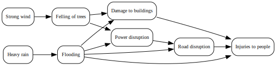
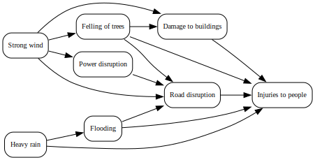

# LLM-SocialMedia-Causality: Ground-Truth Hurricane Causal Graphs

This repository provides ground-truth causal graphs for selected U.S. hurricanes, constructed using the **Impact Chain concept** from Pittore et al. (2023) and Zebisch et al. (2021), and validated through expert NOAA reports.

---
## Overview: Impact Chain

The causal graphs in this repository are based on the **Impact Chain framework**—a standardized approach for analyzing cause–effect relationships in climate-related hazards.  
Originally introduced in the *Vulnerability Sourcebook* (Zebisch et al., 2021) and later extended by Pittore et al. (2023) for multi-hazard exposure modeling, the framework systematically describes how environmental drivers lead to hazards, exposure, and impacts.

In this repository, the framework is applied to two hurricane events, linking the hazards to their resulting risks.  
Vulnerability components are not included, due to their complexity and the challenge of achieving consistent expert validation across different events.

---

## Hurricane Causal Graphs
We start from the [generic Impact Chain for storm events](docs/impact_chain_for_storm.svg) and refine it by filtering only those cause–effect relationships that are explicitly supported by evidence in NOAA’s Tropical Cyclone Reports.  
Validation focuses on causal relationships explicitly documented in NOAA’s reports—such as links between flooding and injuries or between wind intensity and structural damage.

| Hurricane | Causal Graph | Graphviz Source | Evidence Summary | NOAA Report |
|------------|---------------|-----------------|------------------|--------------|
| Harvey (2017) |  | [DOT](data/hurricane_harvey/hurricane_harvey_causal_graph.dot) | [Summary](data/hurricane_harvey/evidence_summary.md) | [NOAA Report](https://www.nhc.noaa.gov/data/tcr/AL092017_Harvey.pdf) |
| Irma (2017) |  | [DOT](data/hurricane_irma/hurricane_irma_causal_graph.dot) | [Summary](data/hurricane_irma/evidence_summary.md) | [NOAA Report](https://www.nhc.noaa.gov/data/tcr/AL112017_Irma.pdf) |

---

## References

- Pittore, M., Campalani, P., Renner, K., Tagliavini, F., & others (2023).  
  *Border-independent multi-functional, multi-hazard exposure modelling in Alpine regions.*  
  *Natural Hazards, 119(2), 1–22.*  
  [https://doi.org/10.1007/s11069-023-06134-3](https://doi.org/10.1007/s11069-023-06134-3)

- Zebisch, M., Schneiderbauer, S., Fritzsche, K., Bubeck, P., Kienberger, S., Kahlenborn, W., Schwan, S., & Below, T. (2021).  
  *The vulnerability sourcebook and climate impact chains — a standardised framework for a climate vulnerability and risk assessment.*  
  *International Journal of Climate Change Strategies and Management, 13(1), 35–59.*

- Cangialosi, J. P., et al. (2018).  
  *National Hurricane Center Tropical Cyclone Report: Hurricane Harvey (AL092017).*  
  [https://www.nhc.noaa.gov/data/tcr/AL092017_Harvey.pdf](https://www.nhc.noaa.gov/data/tcr/AL092017_Harvey.pdf)

- Cangialosi, J. P., et al. (2021).  
  *National Hurricane Center Tropical Cyclone Report: Hurricane Irma (AL112017).*  
  [https://www.nhc.noaa.gov/data/tcr/AL112017_Irma.pdf](https://www.nhc.noaa.gov/data/tcr/AL112017_Irma.pdf)
